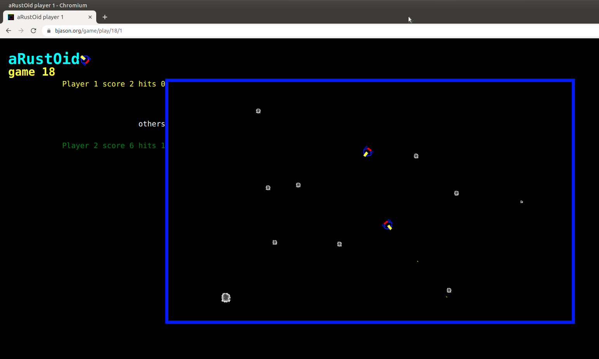

# aRustOid

a WebAssembly game written in Rust with a backend webserver using websockets to handle multiple players.

A simple game to blow up as many rocks as possible, hopefully beating player 2. To run multiplayer player 1 kicks
off the game, then player 2 needs to select the correct game number from the list

Use left,right,up arrow keys  and space to fire



to try live go to https://bjason.org/game

to build and run locally
```
# get rust
curl --proto '=https' --tlsv1.2 -sSf https://sh.rustup.rs | sh
# uses SDL2 as well as opengl
sudo apt install libsdl2-dev

# you need emscripten to handle compilation to WebAssembly
git clone https://github.com/emscripten-core/emsdk.git
cd emsdk
./emsdk install 1.39.20
./emsdk activate 1.39.20
# either update your profile or source in emsdk_env.sh as advised by emsdk
source emsdk_env.sh

# add web target for rust
rustup target add wasm32-unknown-emscripten 

# Rocket needs nightly build
rustup toolchain install nightly
rustup default nightly

# first build the application
cargo build --target=wasm31-unknown-emscripten && cp target/wasm32-unknown-emscripten/debug/arustoid* pkg/

# now build the webserver
cd rust_socket_arustoid
cargo build 
cargo run
```
go to http://127.0.0.1:8000

